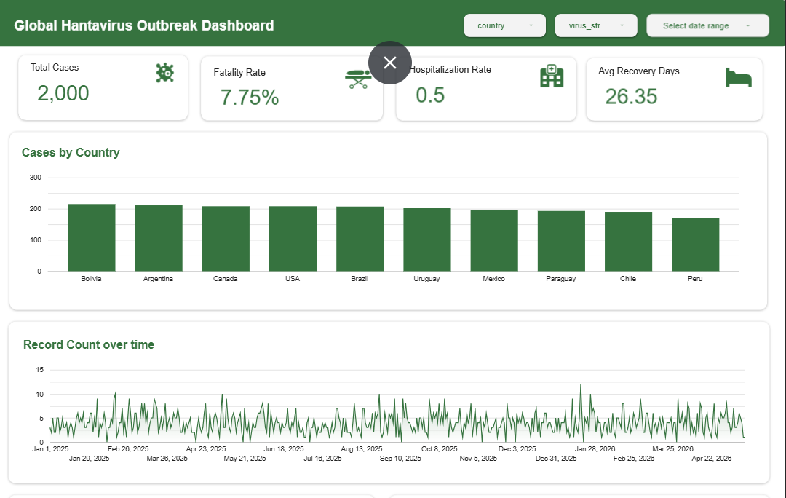

# 🦠 Global Hantavirus Outbreak Analysis Dashboard

## 📌 Project Overview

This project analyzes global hantavirus outbreak patterns using epidemiological, demographic, and environmental data to uncover transmission trends, severity indicators, and risk factors affecting hospitalization, fatality, and recovery outcomes.

The analysis aims to transform raw healthcare data into actionable insights through exploratory data analysis (EDA), SQL-based querying, and interactive dashboard development.

---

## 🎯 Objectives

* Identify outbreak hotspots by country and region
* Analyze dominant virus strains and transmission patterns
* Investigate environmental factors influencing outbreak severity
* Explore demographic risk indicators related to hospitalization and fatality
* Develop an interactive healthcare intelligence dashboard

---

## 🛠 Tech Stack

* **Python**

  * Pandas
  * NumPy
  * Matplotlib
  * Seaborn

* **SQL**

  * Data aggregation
  * Risk analysis query
  * KPI calculation

* **Google Looker Studio**

  * Interactive dashboard visualization

* **Google Colab**

  * Data preprocessing & EDA

---

## 📂 Project Structure

```bash
global-hantavirus-outbreak-analysis/
│── data/
│   ├── global_hantavirus_surveillance_dataset_2026.csv
│   ├── cleaned_hantavirus_dataset.csv
│
│── notebook/
│   ├── Hantavirus.ipynb
│
│── sql/
│   ├── hantavirus_analysis.sql
│
│── dashboard/
│   ├── dashboard_preview.png
│
│── README.md
```

---

## 🔍 Key Analysis Performed

### 1. Data Cleaning & Preprocessing

* Missing value handling
* Datatype conversion
* Feature engineering
* Duplicate removal
* Data consistency checking

### 2. Exploratory Data Analysis

* Country outbreak analysis
* Virus strain distribution
* Transmission pattern analysis
* Demographic profiling
* Symptoms frequency analysis

### 3. Advanced Business Analysis

* Fatality rate analysis
* Hospitalization trend analysis
* Environmental risk factors
* Severity score modeling
* Risk categorization

### 4. Dashboard Development

Interactive healthcare intelligence dashboard built in Google Looker Studio.

Dashboard pages include:

* Executive Overview
* Patient Demographic Analysis
* Environmental Risk Dashboard
* Virus Intelligence Dashboard

---

## 📈 Key Findings

* Human-to-human transmission represented a major outbreak pattern.
* Higher rodent presence was associated with increased transmission risk.
* Senior patients showed higher hospitalization probability.
* Virus severity varied significantly across strains.
* Population density may contribute to outbreak frequency.

---

## 📊 Dashboard Preview

```md

```

---

## 🔗 Dashboard Link

Add your Google Looker Studio dashboard link here:

```txt
https://datastudio.google.com/reporting/f5ee654b-0747-47df-b924-360cd2071421
```

---

## 🚀 Business Impact

This analysis demonstrates how healthcare and environmental data can be leveraged to identify outbreak risks, prioritize healthcare response, and improve epidemiological understanding.

---

## 👩‍💻 Author

**Zulfianti Rahmawati Ashilah**
Aspiring Data Analyst | Data Visualization | Business Intelligence
